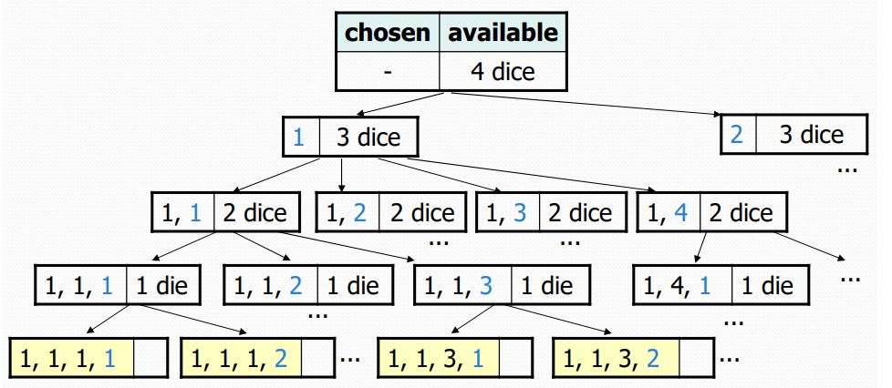
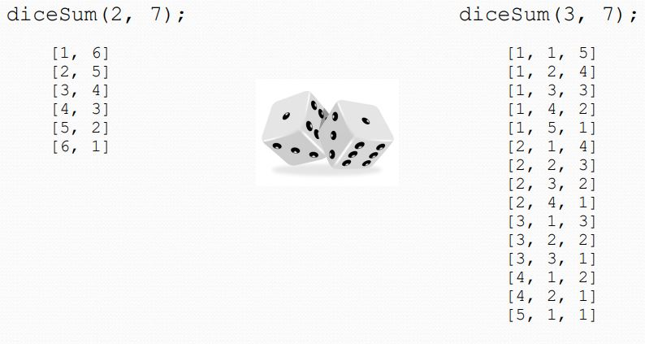
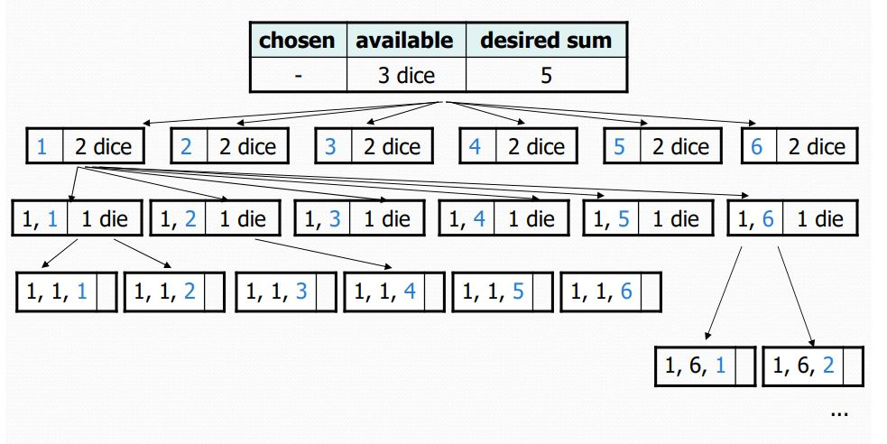
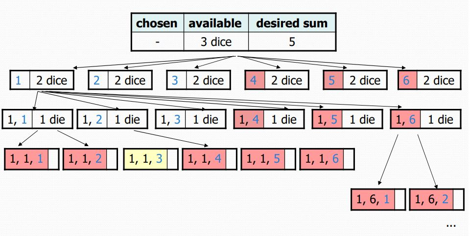
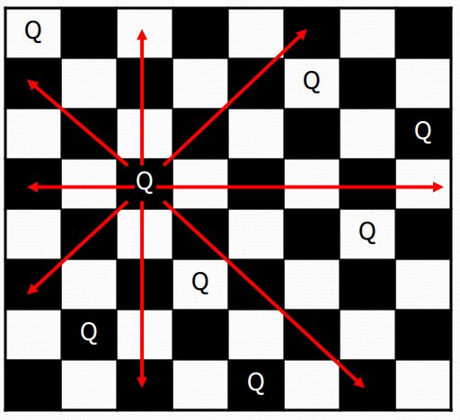

# Рекурсивное программирование
## Рекурсия и случаи

Каждый рекурсивный алгоритм включает как минимум 2 случая:

+   **базовый вариант**: простая задача, которую можно решить напрямую (например, факториал).
+   **рекурсивный случай**: более сложное возникновение проблемы, на которое нельзя дать прямой ответ, 
но вместо этого его можно описать в терминах меньших случаев возникновения той же проблемы.
+   Некоторые рекурсивные алгоритмы имеют более одного базового или рекурсивного случая, но у всех есть хотя бы один из них.
+   Важной частью рекурсивного программирования является выявление этих случаев.

Попробуйте решить следующую задачу:
Написать рекурсивный метод pow, принимающий два целочисленных параметра и возвращающий степень первого число во втором.

Например, pow(3, 4) вернет 81.

Решите используя рекурсию и без циклов.

Попробуйте оптимизировать метод используя правило 3^{12}=531441=9^6=(3^2)^6=((3^2)^2)^3

#### Упражнение
Напишите рекурсивный метод со строкой в параметре, который возвращает true, если строка читается одинаково с обоих концов. Например: "А роза упала на лапу Азора".


## Сочетание вспомогательных методов
Зачастую необходимых параметров недостаточно для решения задачи, 
а в месте запуска лишние параметры также ни к чему. 
Поэтому используют пару методов:

1.  нерекурсивный метод с параметрами для клиента;
2.  рекурсивный метод с параметрами которые вам необходимы. 
Обычно такие методы называют вспомогательными (helper).


## Проблемы рекурсии

+   Забыть базовый случай, для выхода из рекурсии
    +   Бесконечная рекурсия приводит к переполнению стека вызовов
+   Работа вдали от базового варианта
    +   Рекурсивный случай должен продвигаться к базовому сценарию
    +   Бесконечная рекурсия приводит к переполнению стека вызовов
+   Недостаточно памяти
    +   Для некоторых входных данных может потребоваться слишком много 
    рекурсивных вызовов: переполнение стека вызовов
+   Повторное выполнение одной и той же подзадачи снова и снова
    +   Усовершенствование алгоритма может сэкономить значительное время

## Рекурсивный возврат

### Упражнение:

Написать метод diceRoll, принимающий в параметре число костей, и выводящий все возможные комбинации.


#### Изучение проблемы

Мы должны сгенерировать все возможные последовательности
```
foreach(все возможные варианты первой кости)  
    foreach(все возможные варианты второй кости)  
        foreach(все возможные варианты третьей кости)  
            ...  
                print!  
  ```

Как мы можем полностью исследовать такое большое пространство поиска?

Решение рекурсивно:

+   Выберите значение для первого кубика
+   Рекурсивно найти значения для оставшейся кости
+   Повторите с другими значениями для первого кубика
+   Каков базовый случай?




<details>
  <summary>Решение</summary>
  
```cpp
#include <iostream>
using namespace std;

void print(int* list) {
	cout << "[";
	int n = _msize(list) / sizeof(int);	// так можно узнать размер массива
	for (int i = 0; i < n; i++)
	{
		cout << list[i] << (i == n - 1 ? "" : ", ");  // тернарный оператор
	}
	cout << "]\n";
}

/*вспомогательная функция добавляющая элемент в динамический массив*/
int* add(int* source, int m) {
	int size = _msize(source) / sizeof(int);	// так можно узнать размер массива
	int* dest = new int[size + 1];
	for (int i = 0; i < size; i++)
		dest[i] = source[i];
	dest[size] = m;
	delete[] source;
	return dest;
}

/*вспомогательная функция удяляющая элемент в динамическом массиве под номером pos*/
int* remove(int* source, int pos) {
	int size = _msize(source) / sizeof(int);	// так можно узнать размер массива
	int* dest = new int[size - 1];
	int k = 0;
	for (int i = 0; i < size; i++) {
		if (pos != i) {
			dest[k] = source[i];
			k++;
		}
	}
	delete[] source;
	return dest;
}

void diceRoll(int count, int* &list) {
	if (count == 0) {		// простейший случай. если бросков больше не осталось, выводим комбинациЮ на экран.
		print(list);
	}
	else {
		for (int i = 1; i <= 6; i++) {     // for all possible choices  
			list = add(list, i);					// добавляем в массив выпавшее число кубика
			diceRoll(count - 1, list);				// рекурсия с шагом, убавляем количество кубиков
			int size = _msize(list) / sizeof(int);  // вычисляем размер массива
			list = remove(list, size - 1);			// удаляем последний элемент массива
		}
	}

}

void diceRoll(int count) {
	int* list = new int[0]; // создаем пустой динамический массив
	diceRoll(count, list);
}


int main()
{
	diceRoll(3);
}

```
  </details>

### Возврат (Backtracking)

+   возврат: поиск решения путем попытки частичного решения, а затем откат если условие стало невыполнимо.
+   алгоритмическая техника "полного перебора" (пробует все пути);
+   часто реализуется рекурсивно.

### Приложения

+   производить все перестановки набора значений
+   синтаксический анализ языков
+   игры: анаграммы, кроссворды, словесные беспорядки, 8 королев
+   комбинаторика и логическое программирование.

Базовый алгоритм:

+ если вариантов выбора больше нет: 
    + остановить алгоритм.  
+ иначе: 
    + сделать одиночный выбор **С**  
    + перейти к следующему выбору  
    + вернуть выбор **С** (возврат!)  
  
Вернемся к предыдущему упражнению и изменим его. Допустим, теперь нам необходимо вывести все возможные комбинации с определенной суммой.



Древо принятия решений станет следующим:



Оптимизации:

+   нам не нужны все ветви
    +   некоторые ветви уже не подходят
    +   нам незачем их обходить
+   Неэффективность в нашем алгоритме суммы костей:
    +   Иногда текущая сумма уже слишком высока.
        +   (Даже если бы выпала единица для всех оставшихся кубиков превысил бы сумму.)
    +   Иногда текущая сумма уже слишком мала.
        +   (Даже бросок 6 для всех оставшихся кубиков не достигнет суммы.)
    +   По окончании код должен вычислять сумму каждый раз.
        +   (1 + 1 + 1 = ..., 1 + 1 + 2 = ..., 1 + 1 + 3 = ..., 1 + 1 + 4 = ..., ...)
        


#### Упражнение
Решите эту задачу. Потребуются дополнительные параметры во вспомогательном методе: желаемая сумма и текущая сумма.

## Задача 8 королев

Классическая задача по поиску с откатом: на шахматной доске расставить 8 королев так, чтобы ни одни из них не била друг друга.



+   Как сделать ход?
+   Как сделать ход и откат хода?
+   Как узнать когда остановиться?

#### Наивный алгоритм

+   foreach (квадрат на доске)
    +   Поставить королеву.
    +   Попробовать поставить остальных.
    +   Переставить королеву.

Какова оценка алгоритма?

64 \* 63 \* 62 \* ...

64!

#### Алгоритм "по-лучше"

Только одна королева может быть выставлена в одной строке или столбце.

Какова оценка алгоритма сейчас? 


#### Вернемся к алгоритму с возвратом

+   если вариантов выбора больше нет: остановить алгоритм.
+   иначе, для каждого возможного варианта:
    +   сделать выбор **С**
    +   перейти к следующему выбору
    +   вернуть выбор **С**, если необходимо. (возврат!)

#### Упражнение
Безопасно расставьте королев на шахматной доске.

Предлагаю следующие функции:
+   string** Board(int size)  // создает доску (двумерный массив), размером size*size
+   bool isSafe(int row, int column) // возвращает true если королева может быть безопасно поставлена на ячейку с номером
+   void place(int row, int column) // поставить королеву на заданную позицию
+   void remove(int row, int column) // убрать королеву с указанной позиции
+   void print(string** board) // отобразить доску в текстовом виде, например, королеву обозначить буквой Q, пустую клетку нижним подчеркиванием "_".

Напишите метод solveQueens, который принимает Board в качестве параметра, и безопасно устанавливает 8 королев.

